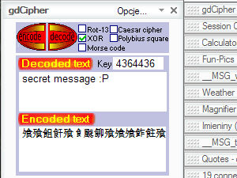

# gdcipher

Plugin dla programu Google Desktop służący do szyfrowania tekstu jednym z 5 najprostszych szyfrów.

Screeny
-------

Technologie
-----------
* Google Gadgets Designer
* JavaScript
* XML

Uwagi
-----
- Plugin powstał w roku 2006 dla Google Desktop ver. 4.2006.505.0 i raczej nie będzie już uaktualniany :P.
